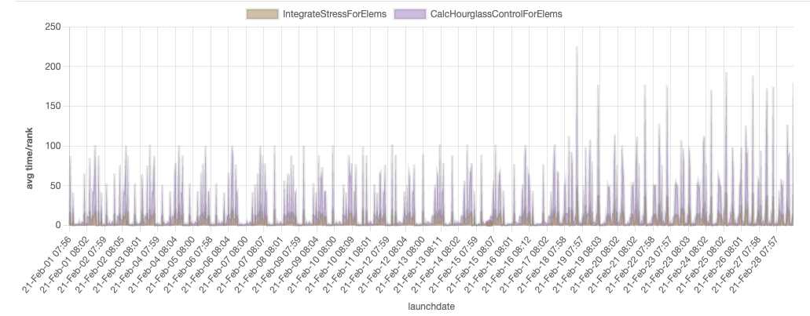

Quick Start Guide
=================

This guide will help you get started with TreeScape quickly.

Introduction
------------

TreeScape is a Jupyter-based visualization tool for performance data, enabling
users to programmatically render graphs. With TreeScape, you can load an
ensemble of `Caliper <https://github.com/LLNL/caliper>`_ performance files and
visualize the collective performance of an application across many runs.

TreeScape is the replacement for SPOT, which was web-based.
TreeScape is built on top of Jupyter notebooks, which are a way to create
and share documents that contain live code, equations, visualizations and narrative text.
TreeScape is designed to be used interactively in a Jupyter notebook.
You can also use TreeScape in a Python script.

.. raw:: html

    <iframe width="560" height="315" src="https://www.youtube.com/embed/RoAgG0UlVAc?si=zj78vHf75u2I5Yau" title="YouTube video player" frameborder="0" allow="accelerometer; autoplay; clipboard-write; encrypted-media; gyroscope; picture-in-picture; web-share" referrerpolicy="strict-origin-when-cross-origin" allowfullscreen></iframe>

`Watch on YouTube <https://www.youtube.com/watch?v=RoAgG0UlVAc>`

Basic Workflow
--------------

TreeScape follows a simple workflow:

1. **Load Data**: Use a Reader to load Caliper performance files
2. **Create Model**: Create a TreeScapeModel from the reader
3. **Visualize**: Use StackedLine or MultiLine to visualize the data

Example 1: Interactive Visualization
-------------------------------------

.. code-block:: python

    import treescape as ts

    # Load all runs from a scaling study
    cali_file_loc = "../datasets/newdemo/test"
    reader = ts.CaliReader(cali_file_loc)
    model = ts.TreeScapeModel(reader)

    # Create visualization
    viz = ts.StackedLine()
    viz.setXAxis("launchdate")
    viz.setYAxis("avg")
    viz.setDrillLevel(["IntegrateStressForElems", "CalcHourglassControlForElems"])
    viz.render(model)

Example 2: Multiple Caliper Files
----------------------------------

You can load multiple Caliper files from different sources:

.. code-block:: python

   import treescape as ts

   # Load from multiple directories or files
   paths = [
       "/path/to/run1/",
       "/path/to/run2/",
       "/specific/file.cali"
   ]

   reader = ts.CaliReader(paths)
   model = ts.TreeScapeModel(reader)

   viz = ts.StackedLine()
   viz.setXAxis("problem_size")
   viz.setDrillLevel(["main", "compute_loop"])
   viz.render(model)

Example 3: Static Matplotlib Plot
----------------------------------

For publication-quality plots, use MultiLine:

.. code-block:: python

   import treescape as ts

   reader = ts.CaliReader("/path/to/cali/files")
   model = ts.TreeScapeModel(reader)

   # Filter and sort the data
   sorted_model = sorted(model, key=lambda x: x.metadata["launchdate"])

   # Create a multi-line plot
   ml = ts.MultiLine(sorted_model)
   ml.plot_sums(
       xaxis="launchdate",
       node_name="main",
       line_metadata_name="test"
   )

Example 4: Using ThicketReader
-------------------------------

TreeScape also supports the Thicket library:

.. code-block:: python

   import treescape as ts
   import thicket as tt

   # Load files using Thicket
   profiles = ["/path/to/file1.cali", "/path/to/file2.cali"]
   th_ens = tt.Thicket.from_caliperreader(profiles)

   # Create ThicketReader
   reader = ts.ThicketReader(th_ens, profiles, xaxis="launchdate")
   model = ts.TreeScapeModel(reader)

   # Visualize
   viz = ts.StackedLine()
   viz.render(model)

Customizing Visualizations
---------------------------

StackedLine offers many customization options:

.. code-block:: python

   viz = ts.StackedLine()

   # Axis configuration
   viz.setXAxis("problem_size")
   viz.setYAxis("max")  # Options: "sum", "avg", "max", "min"

   # Aggregation method
   viz.setXAggregation("topmax")  # Options: "sum", "avg", "max", "min", "topmax"

   # Y-axis limits
   viz.setYMin(0.0)
   viz.setYMax(100.0)

   # Chart dimensions
   viz.setWidth(1200)
   viz.setHeight(600)

   # Select components to show
   viz.setComponents([ts.StackedLine.LINEGRAPHS, ts.StackedLine.FLAMEGRAPHS])

   # Drill into specific functions
   viz.setDrillLevel(["main", "compute_loop", "io_operations"])

   viz.render(model)

Working with the Data Model
----------------------------

The TreeScapeModel is iterable and can be manipulated:

.. code-block:: python

   import treescape as ts

   reader = ts.CaliReader("/path/to/cali/files")
   model = ts.TreeScapeModel(reader)

   # Iterate over runs
   for run in model:
       print(f"Metadata: {run.metadata}")
       print(f"Performance tree: {run.perftree}")

   # Filter runs
   filtered = [run for run in model if run.metadata["problem_size"] > 100]

   # Sort runs
   sorted_runs = sorted(model, key=lambda x: x.metadata["launchdate"])

   # Create a new model with filtered/sorted data
   new_model = ts.TreeScapeModel(reader, sorted_runs)

Next Steps
----------

* Read the :doc:`concepts` page to understand TreeScape's architecture
* Explore the :doc:`examples` for more advanced use cases
* Check the :doc:`api/readers` for detailed API documentation
